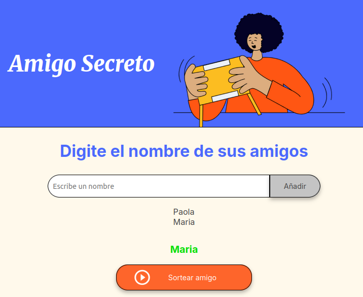

# Challenge Alura - Amigo Secreto

Esta aplicación permite a los usuarios organizar un sorteo de 'Amigo Secreto' de manera sencilla. Los participantes ingresan sus nombres en una lista, la cual se utiliza para realizar un sorteo aleatorio. El resultado, que asigna a cada persona un 'Amigo Secreto', se muestra directamente en la aplicación.

   
